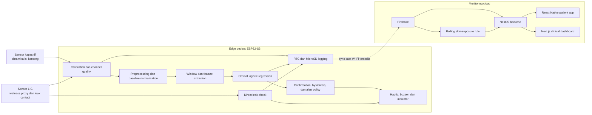
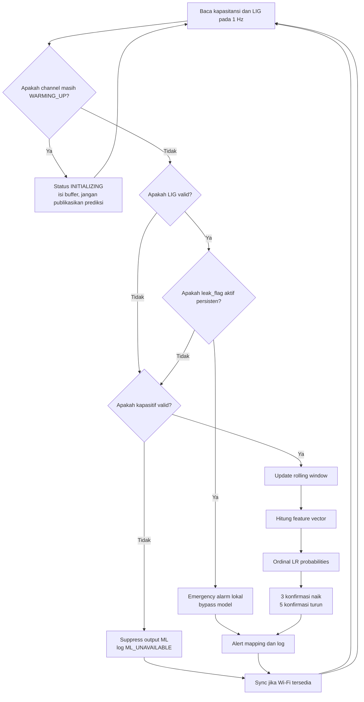
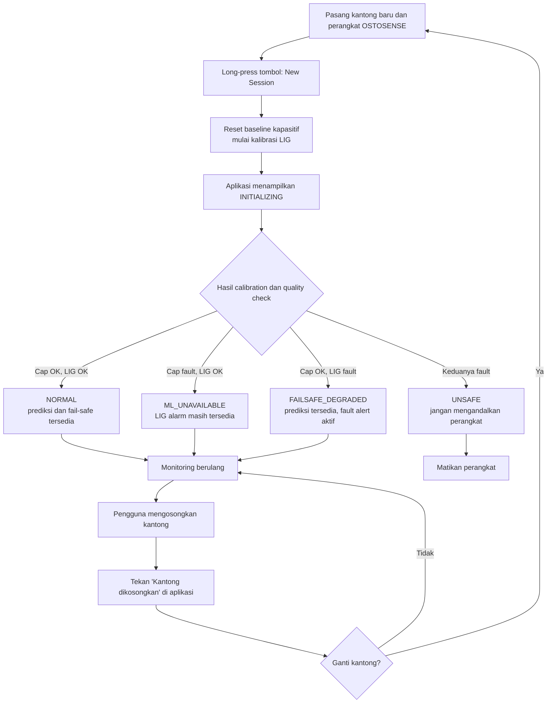
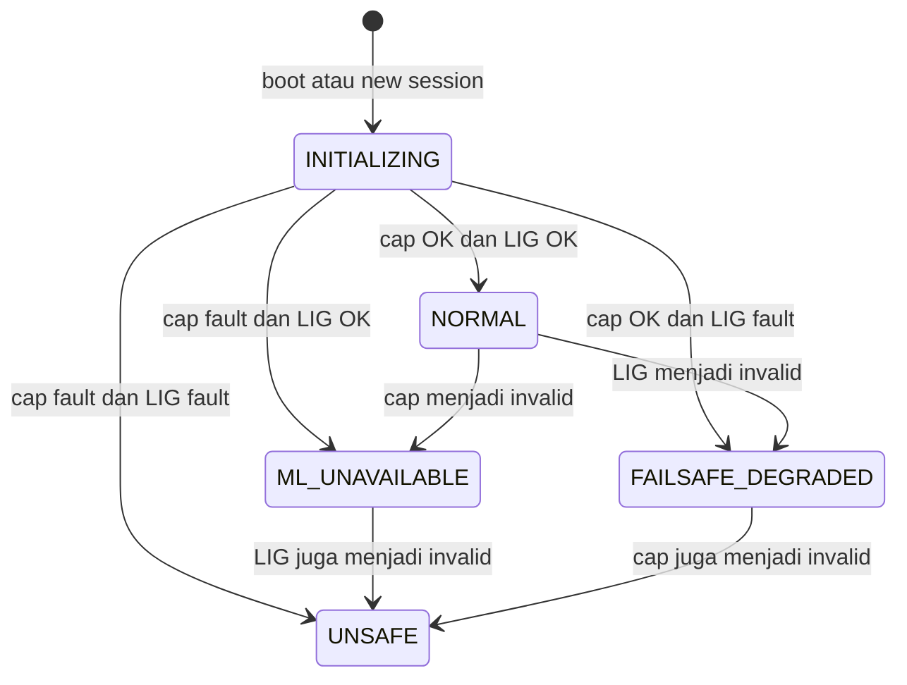
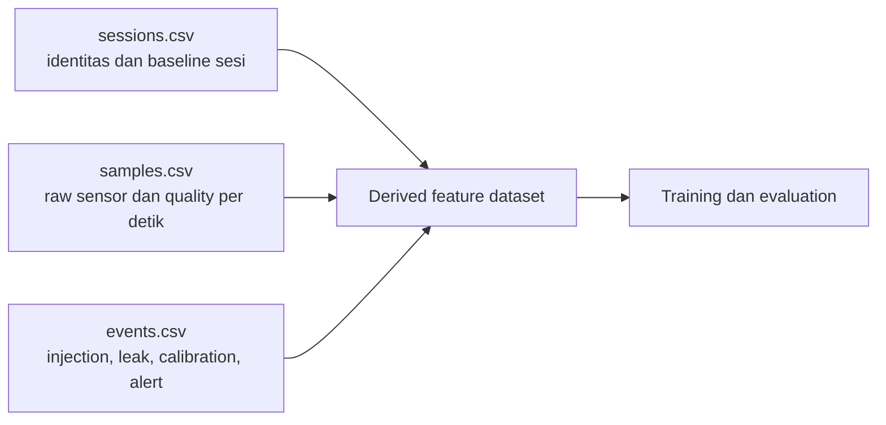
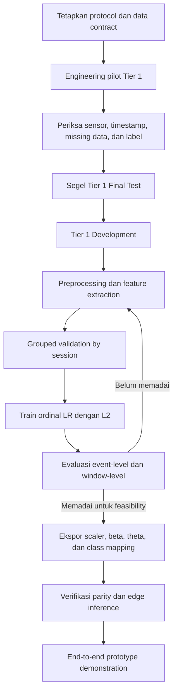

# Fondasi Arsitektur AI OSTOSENSE

**Status:** Panduan konseptual prototipe PKM-KC  
**Acuan data:** OSTOSENSE AI Data Contract v1.1  
**Fokus:** Feasibility, interpretabilitas, dan integrasi end-to-end  
**Bukan:** Spesifikasi perangkat medis siap produksi atau validasi klinis

## 1. Ringkasan Eksekutif

AI OSTOSENSE adalah sistem peringatan dini yang memperkirakan tingkat risiko
kebocoran kantong kolostomi dari pola perubahan kapasitansi. Model berjalan
langsung pada ESP32-S3 agar peringatan tetap tersedia tanpa internet.

Model utama tidak menggantikan sensor kebocoran aktual. Sistem memiliki dua
jalur yang sengaja dipisahkan:

1. **Jalur prediktif:** sensor kapasitif dan ordinal logistic regression
   memperkirakan kelas risiko sebelum kebocoran.
2. **Jalur reaktif:** sensor LIG mendeteksi cairan yang sudah mencapai sensor
   dan memicu alarm langsung tanpa menunggu AI.

Cloud hanya digunakan untuk sinkronisasi, riwayat, aplikasi pasien, dashboard
tenaga kesehatan, dan analisis paparan kulit berbasis aturan. Keputusan alarm
utama tetap lokal.

## 2. Prinsip Desain Prototipe

Seluruh keputusan AI mengikuti prinsip berikut:

- **Selesai lebih penting daripada kompleks.** Model sederhana yang berjalan
  end-to-end lebih bernilai daripada model canggih yang tidak terintegrasi.
- **Data nyata lebih utama.** Bench data adalah sumber bukti utama.
- **Interpretabilitas wajib.** Fitur, bobot, threshold, dan alasan alert harus
  dapat dijelaskan kepada tim dan reviewer.
- **Edge-first.** Internet tidak boleh menjadi syarat sensing, inference,
  logging lokal, atau alarm.
- **Fail-safe terpisah dari AI.** Prediksi yang salah tidak boleh mematikan
  deteksi kebocoran aktual.
- **Tidak membuat klaim klinis berlebihan.** Output adalah indikator risiko
  preventif, bukan diagnosis.
- **Tidak menambah fitur tanpa kebutuhan nyata.** Tier 2, fitur LIG dalam model,
  dan skin-risk scoring tidak boleh menghambat MVP utama.

## 3. Batas Sistem

### 3.1 Yang dilakukan AI

- Membaca pola perubahan isi kantong melalui sensor kapasitif.
- Mengekstrak fitur deret waktu sederhana.
- Mengklasifikasikan kondisi menjadi `Safe`, `Monitor`, `Caution`, atau
  `Urgent`.
- Menghasilkan warning sebelum gradual leakage jika pola sensor mendukung.
- Berjalan lokal pada ESP32-S3.

### 3.2 Yang tidak dilakukan AI

- Mendiagnosis iritasi atau penyakit kulit.
- Memprediksi waktu kebocoran sebagai angka presisi.
- Memprediksi kerusakan seal yang terjadi mendadak tanpa gejala sensor.
- Menggunakan `leak_flag` sebagai fitur prediktif.
- Menggantikan observasi tenaga kesehatan.
- Melakukan cloud inference atau retraining otomatis.

## 4. Arsitektur Sistem Keseluruhan



## 5. Peran Setiap Sinyal

| Sinyal | Bentuk | Peran dalam MVP |
|---|---|---|
| `C_diff(t)` | Nilai kapasitansi diferensial | Input utama model prediktif |
| `lig_raw` | ADC/resistansi belum terkalibrasi | Wetness proxy dan karakterisasi hardware |
| `leak_flag` | Boolean dari jalur LIG | Alarm langsung dan penanda event, bukan fitur ML |
| `cap_quality` | Status kanal | Menentukan apakah inference boleh berjalan |
| `lig_quality` | Status kanal | Menentukan apakah fail-safe tersedia |
| `system_quality` | Status agregat | Menjelaskan kondisi perangkat ke pengguna dan log |

Selama LIG belum dikalibrasi terhadap satuan fisik, sistem tidak menyebut
`lig_raw` sebagai `%RH`. Istilah yang digunakan adalah **wetness proxy**.

## 6. Model AI Utama

### 6.1 Jenis model

Model utama adalah **ordinal logistic regression dengan L2 regularization**.
Model ini dipilih karena:

- Kelas mempunyai urutan alami.
- Jumlah data prototipe terbatas.
- Parameter sedikit dan ringan untuk ESP32-S3.
- Hasil dapat dijelaskan melalui fitur, koefisien, dan threshold.
- Deployment cukup berupa scaler, bobot, dan tiga threshold.

### 6.2 Mental model

Model menghitung satu skor risiko:

```text
eta = beta^T x
```

`x` adalah feature vector, sedangkan `beta` adalah bobot hasil training. Skor
dibandingkan dengan threshold berurutan:

```text
theta_0 < theta_1 < theta_2
```

Semakin tinggi `eta`, semakin besar kecenderungan model memilih kelas risiko
yang lebih tinggi. Model menghasilkan probabilitas empat kelas, lalu memilih
kelas dengan probabilitas terbesar.

### 6.3 Kelas internal dan tampilan

| Kelas internal | Makna | Dashboard tier | Respons lokal |
|---|---|---|---|
| `Safe` | Kondisi stabil/jauh dari endpoint | Low | Tanpa alert |
| `Monitor` | Perubahan mulai perlu diamati | Moderate | Dashboard saja |
| `Caution` | Perlu tindakan preventif | Moderate | Satu pulse haptic |
| `Urgent` | Risiko tertinggi sebelum leak | High | Haptic berulang dan buzzer |
| `Leak` | Cairan sudah terdeteksi LIG | Emergency | Alarm kontinu, bypass ML |

Boundary awal 2/6/12 jam adalah definisi operasional v0, bukan hasil validasi
klinis. Boundary harus dikonfirmasi dari workflow dan pihak medis sebelum
digunakan sebagai klaim final.

## 7. Input dan Feature Engineering

### 7.1 Akuisisi awal

```text
Sampling rate        : 1 Hz
Baseline kapasitif   : median 60 detik
Window v0            : 120 detik
Inference stride v0  : 10 detik
```

Nilai kapasitansi dinormalisasi terhadap baseline sesi:

```text
scale   = max(abs(C_baseline), k * baseline_std, instrument_epsilon)
delta_C = (C_filtered - C_baseline) / scale
```

**Catatan status implementasi (3 September 2026):** rumus berskala di atas
adalah rancangan fondasi, tetapi pipeline fitur/model artifact v0.1 yang sudah
diuji saat ini memakai `delta_C = C_raw - C_baseline` tanpa pembagian `scale`.
Kontrak integrasi v0.2 mengikuti implementasi tersebut agar tidak mencampur dua
skala. Sebelum pelatihan model nyata, tim harus mengunci salah satu rumus,
memberi versi baru bila berubah, lalu melatih dan mengevaluasi ulang model.

### 7.2 Feature set MVP

| Fitur | Intuisi |
|---|---|
| `mean(delta_C)` | Level perubahan rata-rata |
| `last(delta_C)` | Kondisi terbaru |
| `slope(delta_C)` | Kecepatan perubahan isi |
| `variance(delta_C)` | Stabilitas atau noise |
| `range(delta_C)` | Rentang perubahan dalam window |

`time_since_empty` adalah fitur opsional. Fitur ini hanya dipertahankan jika
event pengosongan cukup lengkap dan ablation menunjukkan manfaat nyata. MVP
tidak boleh gagal hanya karena metadata ini tidak tersedia.

## 8. Alur Runtime AI



Catatan: perlakuan `ADC_SATURATED` pada kanal LIG masih menunggu konfirmasi
hardware. Jika wet contact memang dapat menyebabkan saturasi, kondisi tersebut
harus dievaluasi sebagai kemungkinan leak sebelum diklasifikasikan sebagai
fault.

## 9. User Flow



Long-press adalah reset sesi penuh dan hanya digunakan pada kantong baru/kosong.
Ia bukan mekanisme umum untuk memperbaiki LIG di tengah sesi karena reset
baseline kapasitif pada kantong terisi akan menghilangkan referensi level isi.

## 10. State Quality dan Safety



| System quality | Prediksi ML | Direct leak | Makna pengguna |
|---|---:|---:|---|
| `INITIALIZING` | Belum dipublikasikan | Belum dijamin | Kalibrasi berlangsung |
| `NORMAL` | Tersedia | Tersedia | Operasi normal |
| `ML_UNAVAILABLE` | Tidak tersedia | Tersedia | Prediksi mati, fail-safe hidup |
| `FAILSAFE_DEGRADED` | Tersedia | Tidak tersedia | Prediksi hidup tanpa pengaman fisik |
| `UNSAFE` | Tidak tersedia | Tidak tersedia | Perangkat tidak aman diandalkan |

## 11. Logging dan Data Architecture

Data dibagi menjadi tiga tabel agar raw samples, konteks sesi, dan event tidak
tercampur.



Referensi field, enum, timestamp, dan event metadata tersedia pada
[AI Data Contract v1.1](./ai-data-contract-v1.1.md).

Tiga timestamp leakage wajib dipisahkan:

```text
T_physical_leak : observasi/video, ground truth utama
T_flag          : leak_flag pertama aktif
T_confirm       : leak_flag aktif tiga sampel berturut-turut
```

## 12. Pembentukan Label Time-to-Leak

Pada trial gradual, endpoint aktual adalah `T_physical_leak`. Untuk window yang
berakhir pada waktu `t`:

```text
tau = T_physical_leak - t
```

`tau` kemudian dipetakan ke kelas ordinal. Model memprediksi **interval
risiko**, bukan angka waktu yang presisi.

Window setelah physical leakage tidak masuk training prediktif. Data tersebut
disimpan untuk evaluasi sensor dan skin-exposure logging.

## 13. Strategi Eksperimen Tier 1

### 13.1 ARM_LEAK_GRADUAL

Fungsi utama:

- Sumber training dan evaluasi model ordinal.
- Menghasilkan seluruh rentang `Safe` sampai `Urgent` dalam satu trial.
- Mengukur apakah warning muncul sebelum physical leakage.

Variasikan fill rate, orientasi, unit bag/sensor, dan kondisi aktivitas secara
sistematis. Sertakan sub-lethal fills yang berhenti sebelum leak agar model
tidak hanya belajar membedakan "ada injeksi" dan "tidak ada injeksi".

### 13.2 ARM_SAFE

Fungsi utama:

- Mengukur false alert per jam.
- Mengukur baseline drift.
- Memeriksa stabilitas status tanpa event.

ARM_SAFE bersifat right-censored dan tidak digunakan sebagai sumber label
`tau`.

### 13.3 ARM_LEAK_SUDDEN

Fungsi utama:

- Mengukur latency direct leak alarm.
- Memvalidasi jalur fail-safe LIG.

Arm ini tidak digunakan untuk training model ordinal karena kejadian acak tidak
dapat diprediksi dari kapasitansi.

## 14. Alur Pengembangan Model



Semua preprocessing, simulator, window selection, feature selection, dan model
tuning hanya boleh menggunakan Tier 1 Development. Final Test tidak boleh
disentuh sampai evaluasi akhir.

## 15. Evaluasi Model dan Sistem

### 15.1 Metrik primer

Metrik primer dinilai pada level sesi/event:

- **Event detection rate:** persentase gradual leaks yang mendapat warning
  sebelum physical leak.
- **Warning lead time:** selisih `T_physical_leak` dan warning pertama.
- **False Caution/Urgent alerts per hour:** terutama pada ARM_SAFE.
- **Direct alarm latency:** selisih `T_confirm` dan `T_physical_leak` pada
  ARM_LEAK_SUDDEN.
- **Status transitions per hour:** ukuran flicker dan kestabilan.

### 15.2 Metrik sekunder

- Quadratic weighted Cohen's kappa (metrik agreement ordinal resmi; lihat
  `AGENTS.md`, Locked evaluation targets).
- Macro F1.
- Confusion matrix.
- Adjacent-class error rate.
- Urgent-class recall.

Semua headline result berasal dari Tier 1 Final Test dan dilaporkan sebagai
**preliminary feasibility result**, bukan validasi klinis.

## 16. Tier 2 Synthetic Data

Tier 2 bukan syarat MVP. Ia hanya dipertimbangkan setelah:

1. Tier 1 Development cukup untuk memahami respons sensor.
2. Model Tier 1-only sudah menjadi baseline yang berjalan.
3. Simulator dapat dikalibrasi dari Tier 1 Development secara traceable.

Jika digunakan, Tier 2 hanya boleh masuk training. Tier 2 tidak boleh masuk
Final Test atau menjadi sumber angka headline. Bandingkan model Tier 1-only
dengan Tier 1 plus Tier 2 untuk membuktikan bahwa augmentasi benar-benar
memberi manfaat pada data nyata.

## 17. Skin-Exposure Risk Module

Modul risiko paparan kulit adalah sistem rule-based yang terpisah dari model
ordinal leakage. Inputnya berasal dari riwayat event, misalnya:

- Frekuensi leak.
- Estimasi durasi wet contact.
- Durasi paparan terpanjang.
- Respons terhadap alert.
- Alert yang diabaikan.

Modul ini menggunakan rolling history pada backend dan menghasilkan indikator
`Low`, `Moderate`, atau `High`. Ia bukan diagnosis klinis. Bobot dan threshold
tidak menjadi blocker MVP dan hanya boleh difinalkan setelah konsultasi medis.

## 18. Pembagian Edge dan Cloud

| Fungsi | Edge ESP32-S3 | Cloud/app |
|---|---:|---:|
| Sensor acquisition | Ya | Tidak |
| Calibration dan quality check | Ya | Ditampilkan |
| Feature extraction | Ya | Dapat direplikasi untuk analisis |
| Ordinal inference | Ya | Tidak wajib |
| Direct leak alarm | Ya | Menerima event |
| Haptic/buzzer | Ya | Tidak |
| Offline logging | Ya | Tidak |
| Historical trends | Tidak | Ya |
| Skin-exposure rule | Tidak untuk MVP | Ya |
| Model training | Tidak | Offline Python/Colab |

## 19. Offline-First Behavior

```text
Sensor dan inference
        -> local alert
        -> RTC timestamp
        -> append ke MicroSD
        -> coba sinkronisasi jika Wi-Fi tersedia
```

Kegagalan Wi-Fi tidak boleh menghentikan loop. Device tidak perlu restart hanya
karena cloud tidak dapat dihubungi.

## 20. Tahapan MVP yang Disarankan

### Tahap 1: Fondasi data

- Data contract disepakati.
- Logger menghasilkan data lengkap dan konsisten.
- Calibration dan quality state dapat diamati.

### Tahap 2: Karakterisasi sensor

- Respons kapasitansi terhadap volume terlihat.
- Noise, drift, orientation effect, dan unit variance diketahui.
- Perilaku LIG terhadap wet contact dipahami.

### Tahap 3: Model baseline

- Feature pipeline sederhana.
- Ordinal LR Tier 1-only.
- Grouped evaluation tanpa data leakage.

### Tahap 4: Edge integration

- Parameter model dipindahkan ke ESP32-S3.
- Python dan C++ menghasilkan output yang sama.
- Confirmation dan alert mapping bekerja.

### Tahap 5: Demonstrasi end-to-end

- Gradual risk warning.
- Sudden leak fail-safe.
- Offline logging dan reconnect sync.
- Dashboard menampilkan status dan riwayat.

Tier 2 dan skin-risk scoring adalah penguatan setelah alur utama bekerja.

## 21. Kriteria Keberhasilan Prototipe

Prototipe AI dianggap berhasil apabila:

- Raw data, session, dan event dapat direkonstruksi.
- Sensor kapasitif menunjukkan hubungan yang stabil dengan dinamika isi.
- Model menghasilkan kelas ordinal yang masuk akal.
- Warning muncul sebelum sebagian besar gradual leakage pada test prototype.
- False alert dapat diukur dan tidak mendominasi ARM_SAFE.
- LIG memicu alarm langsung dengan latency terukur.
- Device tetap bekerja tanpa Wi-Fi.
- Fault sensor tidak ditampilkan sebagai kondisi normal.
- Seluruh model dapat dijelaskan tanpa bergantung pada jargon kompleks.

## 22. Keputusan yang Masih Menunggu Konfirmasi

### Hardware

- Durasi kalibrasi LIG.
- Validity criteria kalibrasi LIG.
- Apakah mid-session LIG recalibration bermakna secara fisik.
- Apakah wet contact dapat menghasilkan ADC saturation.
- Persistensi calibration state saat device reboot.

### Medis dan workflow

- Boundary operasional 2/6/12 jam.
- Bahasa alert yang tidak menyerupai diagnosis.
- Bobot dan threshold skin-exposure rule.

Keputusan pending ini tidak menghalangi penyusunan protocol dan karakterisasi
sensor, tetapi harus selesai sebelum klaim final atau deployment model.

## 23. Satu Kalimat Penjelasan untuk Reviewer

> OSTOSENSE menggunakan ordinal logistic regression ringan pada ESP32-S3 untuk
> mengubah pola perubahan kapasitansi menjadi peringatan risiko bertingkat,
> sementara sensor LIG menyediakan alarm kebocoran aktual yang independen dari
> model dan tetap berfungsi tanpa koneksi internet.
